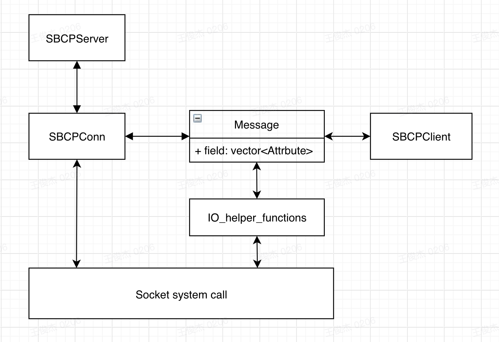

SPRING2021_ECEN602_TEAM07 Author: Junjie Wang
---

### Compile and Usage
To compile the code, use:
```
make server
make client
```
or:
```
make all
```
to compile both client and server.

To start a server, run:
```
# ./server <IPAddr> <PORT> <MaxNumOfClients>
./server 127.0.0.1 8080 3
```

To start a client, run:
```
# ./client <USERNAME> <IPAddr> <PORT>
./client user1 127.0.0.1 8080
```

To send message in a client, just type the message after ">" :
```
> Hi, I'm user1
```
and press ENTER to send.

### Test Script
To run all test cases, execute:
```
./test.sh
```

The output of the test cases are in ```output``` directory. The output files are named as ```{testcaseX}_{clientX}_output``` and ```{testcaseX}_{server}_output``` where X is the number of the testcases or clients.

### Design and Architecture

---
#### Design Goals
This project aims to implement the Simple Broadcast Chat Protocol (SBCP) which consists of four major components:
- Server
- Connections
- Client
- Protocol definition

The Protocol definition can be shared by both server-side and client-side.

--- 
#### Architecture
This program defines 5 class, they are:
- SBCPServer
- SBCPConn
- SBCPClient
- Message
- Attribute

The system structure is as following:



Explanation of each block:
- Socket system call
  
    The socket system calls such as socket(), bind(), listen(), accept(), read(), write(), select(), etc.

- SBCPConn
  
  The SBCP connection class which manage the connections with the server and the clients. It includes information such as the socket file descriptor for that connection, current username, read/write buffer, etc. SBCPConn provides functions to send a given Message to the client or read a Message from the connection.

- SBCPServer
  
  The SBCP server class includes information about current SBCP connections and provides functions to get current user information such as usernames and their status. The SBCP server utilizes functions provided by SBCPConn to read/write Message to the socket.

- Attribute
  
    The class defines the structure of SBCP attribute. It provides funtions to convert between raw byte sequence and structured Attribute object.
  
- Message
  
    The class defines the structure of SBCP message. It includes a vector of Attribute objects and provides funtions to convert between raw byte sequence and structured Message object. It utilizes IO helper functions to send/receive Message directly. SBCPClient uses those funtions to send/receive Message.

- IO_helper_functions
  
    Defines two functions to read/write given bytes from a socket. Used by Message.
    
- SBCPClient
  
    The SBCP client class utilizes functions provided by Message to read/write Message from/to the sockets.

### Contribution
- Junjie Wang:
  - SBCPServer
  - SBCPConn
  - Part of Message (Bonus part)
  - Part of SBCPClient (Bonus part)
  - README
  - report
  - test.sh
  
- Di Tian:
    - SBCPClient
    - Message
    


